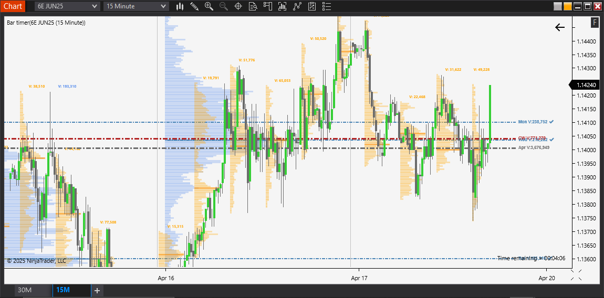
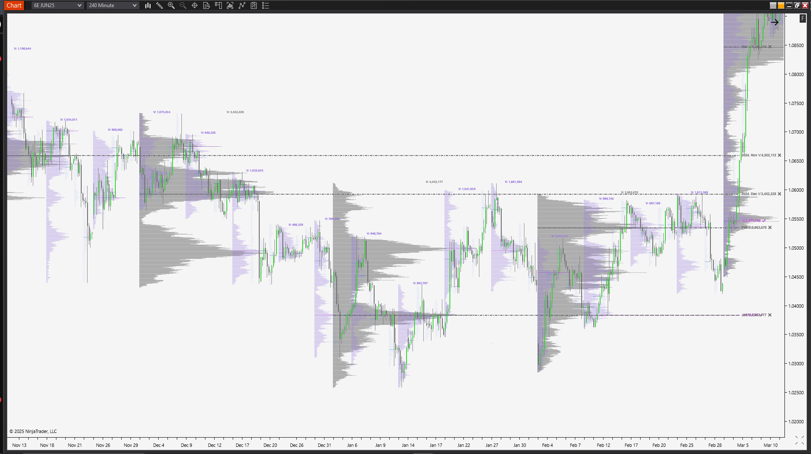
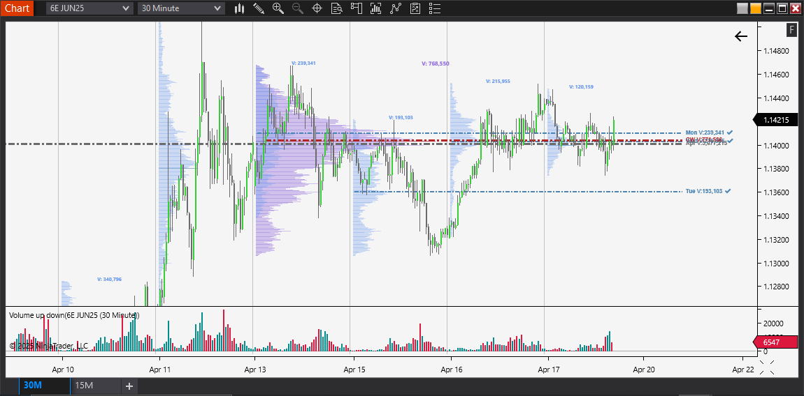

# Volume Profile Analysis

A C# project for analyzing and visualizing volume profiles in trading data. This project is an enhanced version of the [CSharp-NT8-OrderFlowKit](https://github.com/gbzenobi/CSharp-NT8-OrderFlowKit) by Gabriel Zenobi, with optimizations and bug fixes.

## Screenshots

Here are some examples of the Volume Profile indicator in action:

### Multiple Timeframe Analysis

*15-minute chart showing volume profile with price action and key levels*

*4-hour chart demonstrating longer-term volume distribution and support/resistance levels*

*30-minute chart with volume profile*

## Acknowledgments

This project is based on the excellent work of Gabriel Zenobi's [CSharp-NT8-OrderFlowKit](https://github.com/gbzenobi/CSharp-NT8-OrderFlowKit). While the original project provided a solid foundation, this version includes:

- Performance optimizations for better real-time data handling
- Bug fixes for various edge cases and stability issues
- Enhanced volume profile calculations
- Improved memory management

## Project Structure

- `VolumeProfileLines.cs` - Core functionality for volume profile line analysis
- `VolumeAnalysisProfile.cs` - Volume analysis profile implementation
- `FlexibleVolumeAnalysisProfile.cs` - Flexible volume analysis implementation
- `Bookmap.cs` - Bookmap visualization and analysis
- `VolumeFilter.cs` - Volume filtering functionality

While this project builds upon Gabriel Zenobi's [CSharp-NT8-OrderFlowKit](https://github.com/gbzenobi/CSharp-NT8-OrderFlowKit), the core `VolumeProfileLines.cs` and `FlexibleVolumeAnalysisProfile.cs` component is an original implementation created by me

## Installation

1. Copy the files from the `AddOns` folder to your NinjaTrader 8 AddOns directory
2. Copy the files from the `DrawingTools` folder to your NinjaTrader 8 DrawingTools directory
3. Copy the indicator files (`Bookmap.cs`, `VolumeAnalysisProfile.cs`, `FlexibleVolumeAnalysisProfile.cs`, `VolumeFilter.cs`) to your NinjaTrader 8 Indicators folder
4. Enable "Tick Replay" in NinjaTrader 8:
   - Go to Tools -> Options -> Market Data
   - Enable "Show Tick Replay"
5. For each chart where you want to use these indicators:
   - Create a new chart (New -> Chart -> Select your instrument)
   - Enable "Tick Replay" in the Data Series settings

## Getting Started

1. Clone the repository
2. Open the solution in Visual Studio
3. Build and run the project

## Features

- Volume profile analysis
- Flexible volume analysis
- Bookmap visualization
- Volume filtering capabilities

## Requirements

- Visual Studio 2019 or later
- .NET Framework 4.7.2 or later
- NinjaTrader 8

## License

This project is licensed under the MIT License - see the LICENSE file for details. 